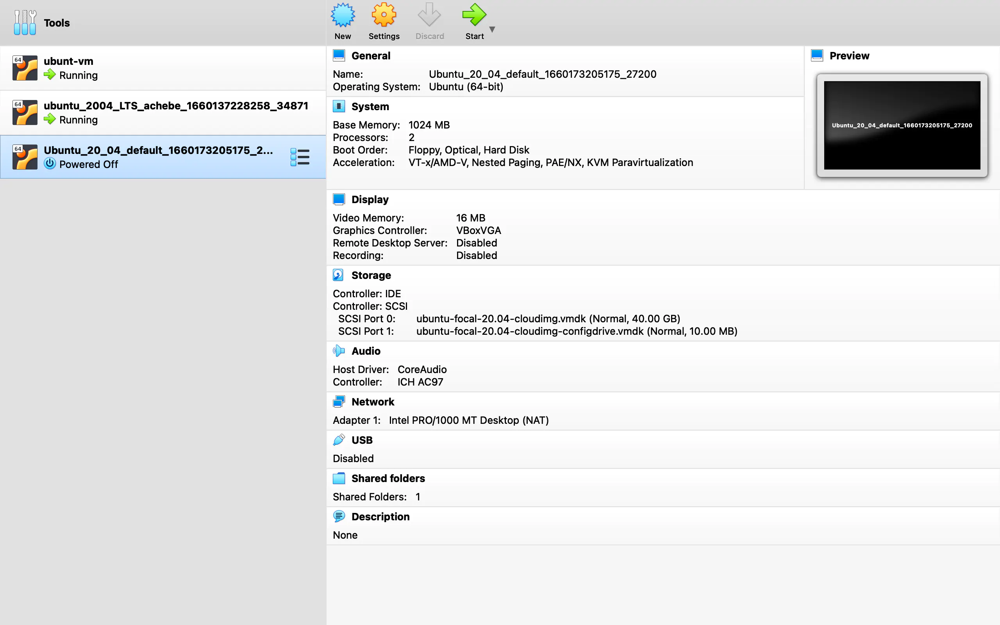
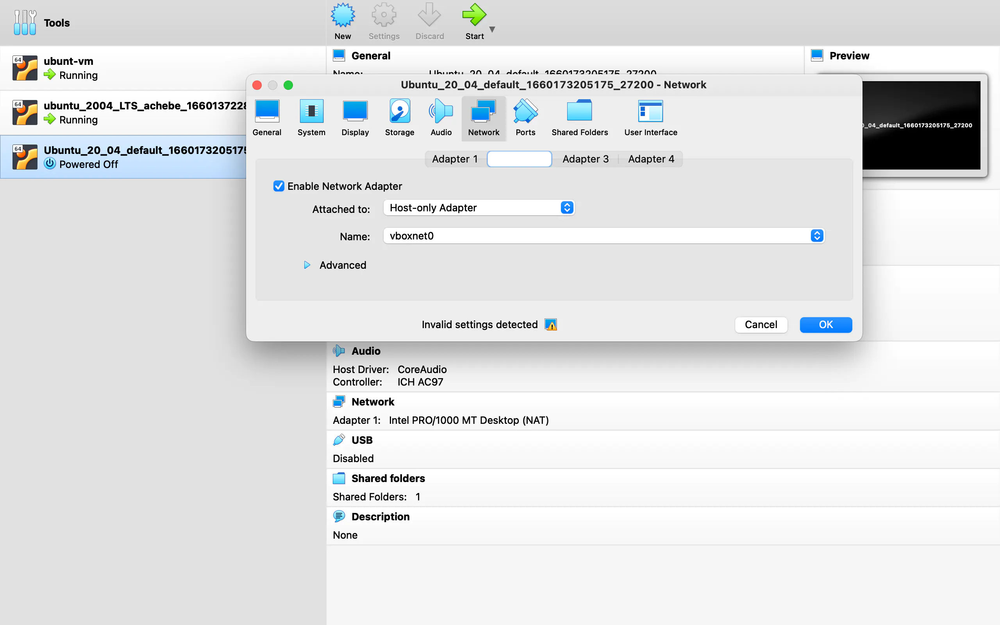

<h1>How them dey setup Ubuntu 20.04 LTS ontop Vagrant Virtual Box</h1>


This tory na to teach how you fit setup Ubuntu 20.04 LTS on top Vigrant VirtualBox. The tutorial go also show how you fit configure the VirtualBox like how you want am. Once we done finish the installation and configuration I go show you how you fit move the ip configuration file were dey your virtual machine come your host machine. 

Omo, if you done read reach here, I thank you ooo, sha manage my tory, na my first time I wan run something like this. Oya my people make we start the matter.

To start the matter you go need go the vagrant official vagrant website to download vagrant enter your host machine or local machine. Just [click](https://www.vagrantup.com/downloads) make you reach were you go download. Once you done download am the installation na straight matter, just dey follow the prompt were the installation dey show you. To know if e install well go your terminal/cmd depending on the machine you day use type 

```
vagrant

``` 

You suppose see something like this were show say e install well.

```
achebe@okechukwus-MacBook-Pro ~ % vagrant
Usage: vagrant [options] <command> [<args>]

    -h, --help                       Print this help.

Common commands:
     autocomplete    manages autocomplete installation on host
     box             manages boxes: installation, removal, etc.
     cloud           manages everything related to Vagrant Cloud
``` 

Once you done finish that one, na to setup the VirtualBox for your machine. E go make sense if de whole installation dey one folder. So we go create folder con enter that folder.

```
achebe@okechukwus-MacBook-Pro ~ % cd Desktop 
achebe@okechukwus-MacBook-Pro Desktop % mkdir -p TestVagrant/Box/Ubuntu_20_04
achebe@okechukwus-MacBook-Pro Desktop % cd TestVagrant/Box/Ubuntu_20_04 
``` 
After we done create the Ubuntu_20_04 folder inside Desktop/TestVagrant/Box folder the next thing na to install the vagrant ubuntu using the "vagrant init" command.

```
vagrant init ubuntu/focal64
``` 
You suppose get this output

```
A `Vagrantfile` has been placed in this directory. You are now
ready to `vagrant up` your first virtual environment! Please read
the comments in the Vagrantfile as well as documentation on
`vagrantup.com` for more information on using Vagrant.
``` 
The next thing na to startup your virtual machine with this command

```
vagrant up
``` 
Once e done finish, you done set to use your virtual machine with ubuntu inside am.
To enter your machine, you go use this command

```
vagrant ssh
``` 
You suppose see this output.

```
Welcome to Ubuntu 20.04.4 LTS (GNU/Linux 5.4.0-122-generic x86_64)

 * Documentation:  https://help.ubuntu.com
 * Management:     https://landscape.canonical.com
 * Support:        https://ubuntu.com/advantage

  System information as of Wed Aug 10 23:19:29 UTC 2022

  System load:  0.01              Processes:               118
  Usage of /:   4.1% of 38.70GB   Users logged in:         0
  Memory usage: 23%               IPv4 address for enp0s3: 10.0.2.15
  Swap usage:   0%


0 updates can be applied immediately.
``` 
To make show say na ubuntu your virtual machine dey run, type this command.

```
hostnamectl
``` 
For my own, see the result wey I get.

```
vagrant@ubuntu-focal:~$ hostnamectl
   Static hostname: ubuntu-focal
         Icon name: computer-vm
           Chassis: vm
        Machine ID: 87a9bd2baeb54bcda24765b89147565a
           Boot ID: 3b9ba20e3d494ac89568bb487c447a7f
    Virtualization: oracle
  Operating System: Ubuntu 20.04.4 LTS
            Kernel: Linux 5.4.0-122-generic
      Architecture: x86-64
``` 
Like this we done finish the installation of ubuntu for our virtual machine, e sweet abi. The next thing we go do na to run some configuration like setting our private_network set to dhcp.

To get your IP address of your virtual machine, you go use

```
ifconfig
``` 
if you get this error

```
vagrant@ubuntu-focal:~$ ifconfig

Command 'ifconfig' not found, but can be installed with:

apt install net-tools
Please ask your administrator.
``` 
You go use the "sudo" command run am, i.e

```
sudo apt install net-tools
``` 
Then run the "ifconfig" command again and you go get something like this.

```
vagrant@ubuntu-focal:~$ ifconfig
enp0s3: flags=4163<UP,BROADCAST,RUNNING,MULTICAST>  mtu 1500
        inet 10.0.2.15  netmask 255.255.255.0  broadcast 10.0.2.255
        inet6 fe80::52:20ff:fe6d:cccd  prefixlen 64  scopeid 0x20<link>
        ether 02:52:20:6d:cc:cd  txqueuelen 1000  (Ethernet)
        RX packets 80714  bytes 112088617 (112.0 MB)
        RX errors 0  dropped 0  overruns 0  frame 0
        TX packets 11575  bytes 942445 (942.4 KB)
        TX errors 0  dropped 0 overruns 0  carrier 0  collisions 0

lo: flags=73<UP,LOOPBACK,RUNNING>  mtu 65536
        inet 127.0.0.1  netmask 255.0.0.0
        inet6 ::1  prefixlen 128  scopeid 0x10<host>
        loop  txqueuelen 1000  (Local Loopback)
        RX packets 49  bytes 4998 (4.9 KB)
        RX errors 0  dropped 0  overruns 0  frame 0
        TX packets 49  bytes 4998 (4.9 KB)
        TX errors 0  dropped 0 overruns 0  carrier 0  collisions 0
``` 
To configure our vagrant virtual machine(VM) to use dchp as private_network so we fit give am our own ip, we go need exit the VM with the "exit" command con halt our VM with "vagrant halt".

```
exit

vagrant halt
``` 
Once we done comot our VM, for the folder wey we run the installation , the installation add one Vagrantfile 
where various vagrant configuration dey. Na from this file you go add our configuration. 

Inside the configuration, add this line of code con save am join.

```
config.vm.network "private_network", type: "dhcp"
``` 
No be here e go end oo, we go need do some small configuration for VirtualBox, ooo I dey assume say you done install VirtualBox and e dey work normal normal from your end.

Oya follow this steps to configure am.




You go select VM wer we done install, take note say vagrant the automatically create the VM for the VirtualBox during in installation.




Select Settings, choose Network then finally select Adapter 2 to add another network adapter. For the "Attached to" dropdown select "Host-only Adapter" then for "Name" dropdown select "vboxnet0", then click OK.

To see wetin we don do, enter your VM with "vagrant ssh" con run the "ifconfig" command. You suppose see some new changes. For my own, see wetin I get.


```
vagrant@ubuntu-focal:~$ ifconfig
enp0s3: flags=4163<UP,BROADCAST,RUNNING,MULTICAST>  mtu 1500
        inet 10.0.2.15  netmask 255.255.255.0  broadcast 10.0.2.255
        inet6 fe80::52:20ff:fe6d:cccd  prefixlen 64  scopeid 0x20<link>
        ether 02:52:20:6d:cc:cd  txqueuelen 1000  (Ethernet)
        RX packets 907  bytes 118268 (118.2 KB)
        RX errors 0  dropped 0  overruns 0  frame 0
        TX packets 696  bytes 126192 (126.1 KB)
        TX errors 0  dropped 0 overruns 0  carrier 0  collisions 0

enp0s8: flags=4163<UP,BROADCAST,RUNNING,MULTICAST>  mtu 1500
        inet **192.168.56.6**  netmask 255.255.255.0  broadcast 192.168.56.255
        inet6 fe80::a00:27ff:fec4:dd3d  prefixlen 64  scopeid 0x20<link>
        ether 08:00:27:c4:dd:3d  txqueuelen 1000  (Ethernet)
        RX packets 24  bytes 11082 (11.0 KB)
        RX errors 0  dropped 0  overruns 0  frame 0
        TX packets 16  bytes 2342 (2.3 KB)
        TX errors 0  dropped 0 overruns 0  carrier 0  collisions 0

lo: flags=73<UP,LOOPBACK,RUNNING>  mtu 65536
        inet 127.0.0.1  netmask 255.0.0.0
        inet6 ::1  prefixlen 128  scopeid 0x10<host>
        loop  txqueuelen 1000  (Local Loopback)
        RX packets 8  bytes 712 (712.0 B)
        RX errors 0  dropped 0  overruns 0  frame 0
        TX packets 8  bytes 712 (712.0 B)
        TX errors 0  dropped 0 overruns 0  carrier 0  collisions 0
``` 
"enp0s8" dey show your new ip address wey be 192.168.56.6. E sweet you abi.

The last thing wey we go do na to transfer the output of our "ifconfig" into a file, then transfer the file enter our local machine wey be the host.

You go run this command to write the output of ifconfig into file wey you go create.

```
ifconfig > ifconfig.txt
``` 
To send this file securely to your host machine you go need install vagrant scp. For this installation, comot your VM, inside the folder wey you install vagrant run this command


```
vagrant plugin install vagrant-scp
``` 
Once this one done finsh, run this commad to transfer the file from the VM to your host machine.

```
vagrant scp default:/home/vagrant/ifconfig.txt  ~/Desktop
``` 
If you check your host Desktop, you go see where the ifconfig.txt file dey sedon jejely for one corner. If you dey wonder wetin be default wey I de use, na the current name of the VM. if you think say I dey lie run this command for the vagrant folder

```
vagrant status
``` 

Omo, I know say this tutorial long small, but no vex at least we achieve wetin we wan do. Na here we finish ooooo. Thank you so much for reading.

